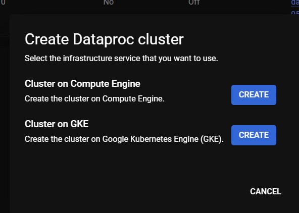
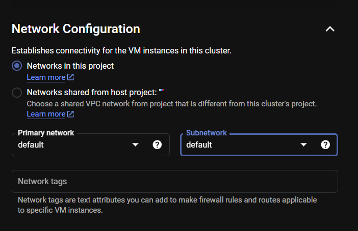
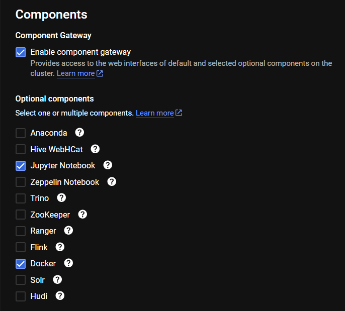
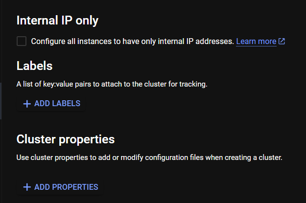
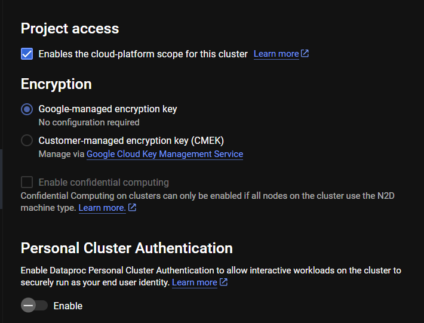

# Project-9-NYC-Data-Analytics-Dataproc-Pyspark

# Introduction - 
This Data Analytics/Data Engineering project involves normalizing and denormalizing existing data for various purposes. A comprehensive data model has been created and visualized to guide the process. The transformation steps required to establish the data model have been executed using Google Cloud Dataproc and PySpark for distributed data processing, instead of the previously planned approach of using Pandas and Mage on a Google Cloud VM. Analytical queries have been written using SQL on BigQuery to analyze the transformed data. Through employing SQL joins, the essential data has been denormalized specifically for the project's dashboard requirements. The final step in this project involves creating an analytics dashboard to visualize and present the denormalized data insights.

# Tech Stack used - 
1. Python - Used the all time famous Pyspark framework
2. Jupyter notebook in Google Cloud Dataproc
3. Lucid Chart to visualize Data Model
4. Google Cloud Storage
5. Google Cloud Bigquery
6. Google Cloud Dataproc
7. Looker Studio

# How to deploy it yourself?
1. The pyspark code creates the following data model👇

2. Now lets get to Google Cloud Platform. Open you Google Cloud Console.
3. Open Bigquery and create a dataset of your choice, for the sake of deployment, I will name it 'uber_data_dataproc' like the image below👇

4. Now we will head to Google Cloud Dataproc to create the spark cluster. Open Dataproc in your console.
5. Click on create cluster and create cluster. Click create on Compute Engine and then set following settings👇

