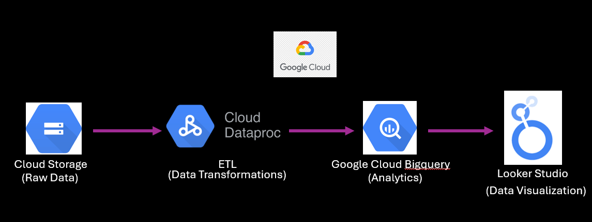
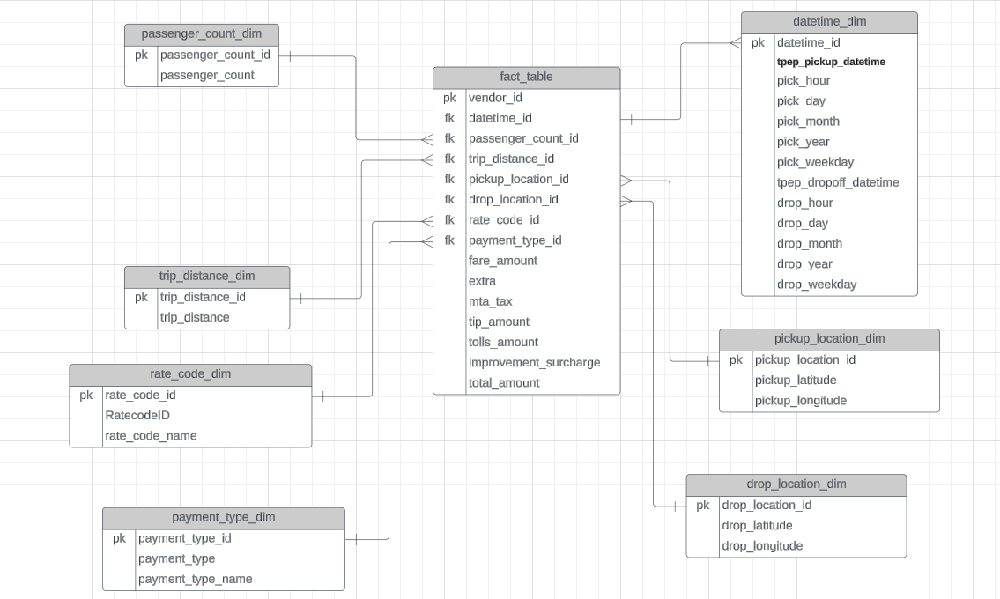
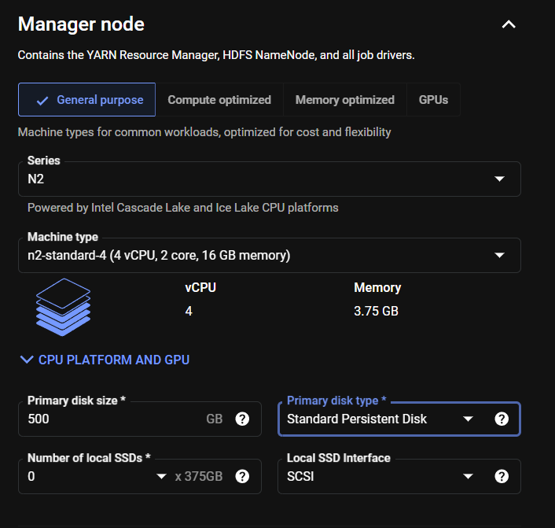
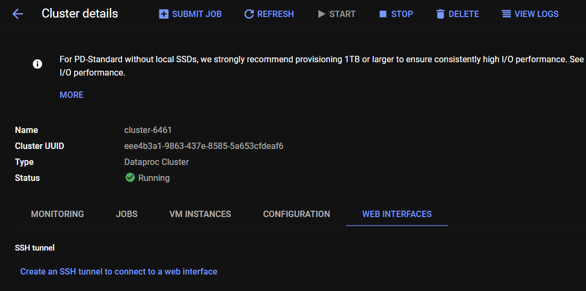
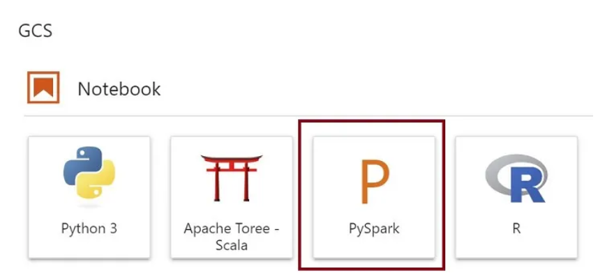
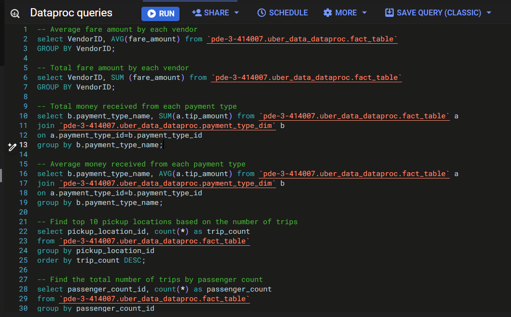
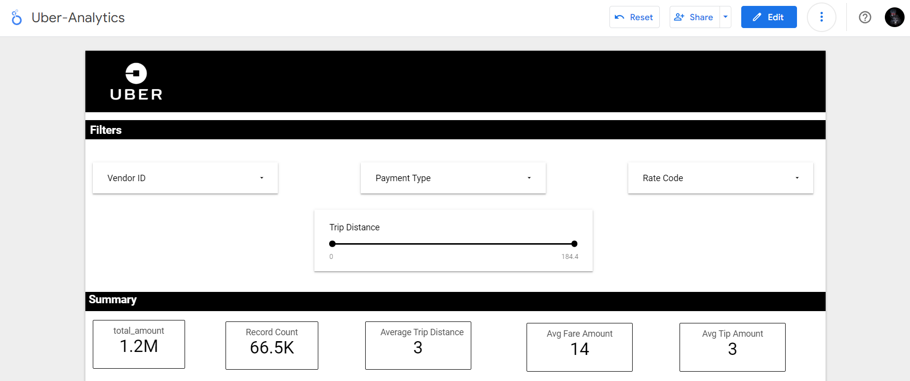
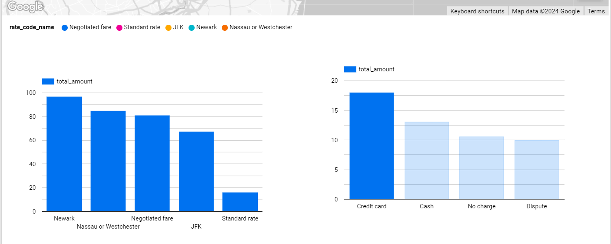

# Project-9-NYC-Data-Analytics-Dataproc-Pyspark

# Introduction - 
This Data Analytics/Data Engineering project involves normalizing and denormalizing existing data for various purposes. A comprehensive data model has been created and visualized to guide the process. The transformation steps required to establish the data model have been executed using Google Cloud Dataproc and PySpark for distributed data processing. Analytical queries have been written using SQL on BigQuery to analyze the transformed data. Through employing SQL joins, the essential data has been denormalized specifically for the project's dashboard requirements. The final step in this project involves creating an analytics dashboard to visualize and present the denormalized data insights.

# Tech Stack used - 
1. Python - Used the all time famous Pyspark framework
2. Jupyter notebook in Google Cloud Dataproc
3. Lucid Chart to visualize Data Model
4. Google Cloud Storage
5. Google Cloud Bigquery
6. Google Cloud Dataproc
7. Looker Studio

# How to deploy it yourself?
1. The pyspark code creates the following data model👇

2. Now lets get to Google Cloud Platform. Open you Google Cloud Console.
3. Open Bigquery and create a dataset of your choice, for the sake of deployment, I will name it 'uber_data_dataproc' like the image below👇

4. Now we will head to Google Cloud Dataproc to create the spark cluster. Open Dataproc in your console.
5. Click on create cluster and create cluster. Click create on Compute Engine and then set following settings👇

6. Click on create and after a few minutes your cluster should be running:) Click on the cluster name.

7. Click on the web interfaces section in the headers.

8. Now click on JupyterLab link under the Component Gateway section.

9. You will be greeted with an introduction page like this where you have to select Pyspark kernel.

10. Now a jupyter notebook will open where you need to copy the code which I have provided in the code.ipynb file in this repo.

11. Now we need the link to our csv data to put it in the code so create a bucket in google cloud storage, make it public and put it's link in the 'Data-Loader' section in the jupyter notebook.
12. Now replace the link to your csv file, edit the dataset names according to your project and start running the notebook cells one by one.
13. After the notebook has successfully run, you can view your table in Bigquery👇

14. Now you can run a few analytical queries to answer questions coming to your mind

15. Now we can also utilize Bigquery to build a Dasboard, but to do so we need a table which has all the columns we need to make it. In order to do that we run the following SQL query - 

16. We can make a dashboard like the one below -

# Extra - 
1. We can make this pipeline event driven by adding cloud functions to trigger the dataproc cluster whenever data is uploaded to Cloud Storage.
2. We can make this a schedule driven pipeline by adding our jupyter notebook as a job and then scheduling the pipeline run using Cloud Scheduler.

# Update - 1
### In this update we will convert our project into an event driven pipeline using Cloud Function and Scheduled Query

# How to do this?
1. Create 2 folders named python and input in our previously used cloud storage bucket.

2. In the python folder place the main.py file in the cloud function folder in this repo.

3. Create a cloud function with the following configurations -

### Thank You😎😎 Keep working - Keep Grinding🫠

